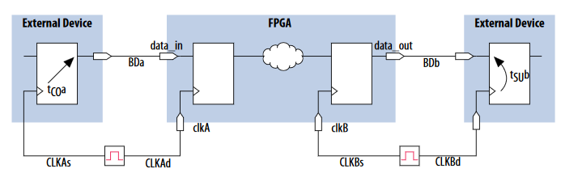
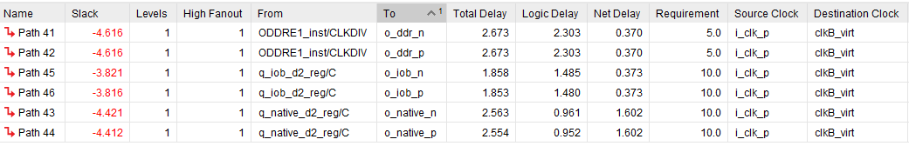
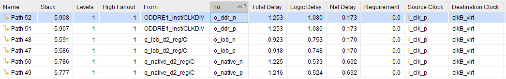
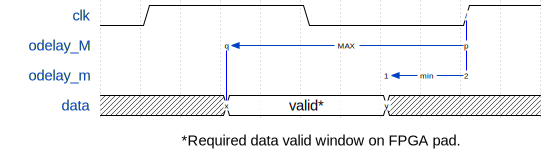
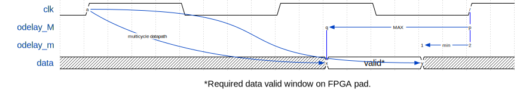
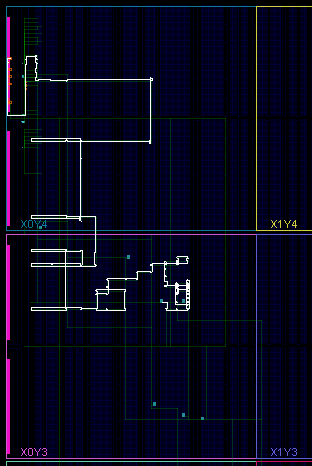
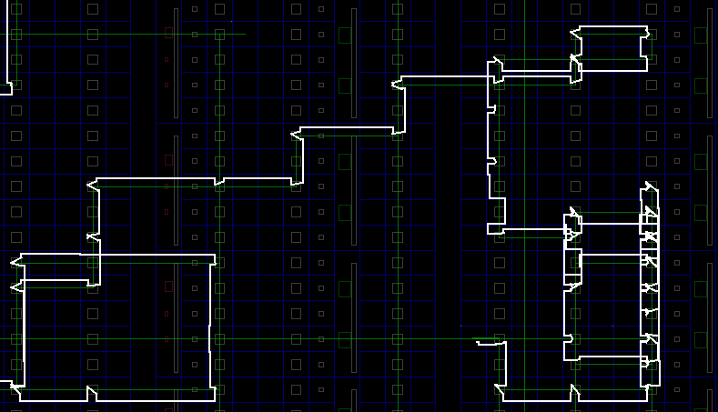
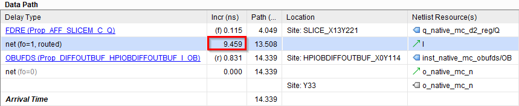
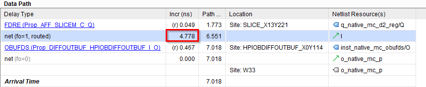

# tco_study
Case study of synchronous FPGA signaling by adjusting the output timing

This is a case-study of synchronous FPGA signaling adjust the t_co (clock-to-output) timing. This
study uses Xilinx's Ultrascale architecture (more precisely the xcku040-ffva1156-2-i device),
however the metodology is general and can be aplied to any FPGA family.

# The problem
Todays protocol mostly are *self synchronous*, which are don't need global synchronous behaviour.
But, in some case we cannot avoid global synchronity. This study shows how can it be achived using
FPGAs even in hard timing cases.

Let's assume that we want to build a [DAQ][1] (Data-acquisition) unit, which requires precision
trigger-timing. All module needs the trigger signal at the same time. (We need to assume that
all module gets the same clock with a given uncereanity.)

# This repository
This repository contains two Vivado project. (More precisely project creator tcl files.) The first
project is located in the [singlecycle](singlecycle) directory. This project demonstrate three
simple trial to met the timing, but the requirements are too hard to achive it, so all outputs are
fail.

The second project is located in the [multicycle](multicycle) directory. This project demonstrate
how to meet the timing using multicycle for the output ports. These are working ideas, the timing
analizer passes.

## Build

To build the projects, just open a Vivado (which supports Kintex Ultrascale devices), enter into
[singlecycle](singlecycle) or [multicycle](multicycle) directory. Then source the project creator
file: `source create_mc_project.tcl`


Then just generate the bitstream.


To see timing details click *Open Implemented Desing*.


# Details
Following chapters will walk torough the very basic (and failing) implementation to three working
solution.

## Timing requirements

This chapter is optional. You can jump to the next section, you just need to accept the minimum
`odelay_m = 3.0` and the maximum `odelay_M = 8.0` output delays.

Altera has a quite good [cookbook][2] how to calculate timing. (Note, that all constraints can be
used for Xilinx's tools too.) The following picture is from that book. Chip-to-Chip Design with
Virtual Clocks as Input/Output Ports:



This study deals with only the *B* side, where the FPGA is the signal driver. Here is the output
timing constraint with beliveable (random) values for the delays. (The *_m denotes the minimum, the
_M denotes the maximum values)

```tcl
# create a 100MHz clock
create_clock -period 10.000 [get_ports i_clk_p]

#create the associated virtual input clock
create_clock -name clkB_virt -period 10

#create the input delay referencing the virtual clock
#specify the maximum external clock delay from the global oscillator towards the FPGA
set CLK_fpga_m 3.5
set CLK_fpga_M 4
#specify the maximum external clock delay from the global oscillator towards the DAQ module
set CLK_daq_m 5
set CLK_daq_M 6.5
#specify the maximum setup and minimum hold time of the DAQ module
set tSUb 2
set tHb 0.5
#Board delay from FPGA to DAQ module (on trigger)
set BD_trigger_m 6.5
set BD_trigger_M 7.0

# odelay_M = 8.0
# odelay_m = 3.0
set odelay_M [expr $CLK_fpga_M + $tSUb + $BD_trigger_M - $CLK_daq_m]
set odelay_m [expr $CLK_fpga_m - $tHb  + $BD_trigger_m - $CLK_daq_M]

#create the output maximum delay for the data output from the
#FPGA that accounts for all delays specified (odelay_M = 8.0)
set_output_delay -clock clkB_virt -max [expr $odelay_M] [get_ports {<out_ports>}]
#create the output minimum delay for the data output from the
#FPGA that accounts for all delays specified (odelay_m = 3.0)
set_output_delay -clock clkB_virt -min [expr $odelay_m] [get_ports {<out_ports>}]
```

So the final numbers for this study are `odelay_M = 8.0` and `odelay_m = 3.0`.

---

## Single-cycle failings

First let's show some simple approach, which doesn't need deep FPGA knowledge. Altough, we will see
that these implementation cannot fulfill these hard timing requirements. And finally we will use
multicycle constraint in the next chapter.

In this chapter all output has the following output delay constraint: (See previous chapter for details)

```tcl
#create the output maximum delay for the data output from the
#FPGA that accounts for all delays specified (odelay_M = 8.0)
set_output_delay -clock clkB_virt -max [expr $odelay_M] [get_ports {<out_ports>}]
#create the output minimum delay for the data output from the
#FPGA that accounts for all delays specified (odelay_m = 3.0)
set_output_delay -clock clkB_virt -min [expr $odelay_m] [get_ports {<out_ports>}]
```

### First (native) implementation

This simple variant used in the [singlecycle](singlecycle) desing `o_native_p` (/n) ports. Simple means a
native, fabric flip-flop output connected to the output buffer) 

```vhdl
-- Native
inst_native_obufds : OBUFDS
generic map(
  IOSTANDARD => "LVDS"
)
port map(
  O  => o_native_p,
  OB => o_native_n,
  I  => q_native_d2
);
```

This implementation will fail the timings. The timing analizer will report negative-slack in the
setup time of the virtual `clkB_virt` clock:

| Port name   | setup slack | hold slack |
|-------------|-------------|------------|
| o_native_p  | -4.421      | 5.777      |

The failing of setup-time means our signal is too slow. Let's try to make it faster!

### Place into IOB

All FPGAs has a dedicated, fast output flip-flop, which placed next to the output buffer. The
[singlecycle](singlecycle) project `o_iob_p` (/n) ports demonstrate this solution.

Using Xilinx FPGAs the IOB propery says the compiler to place the give flip-flop in the dedicated,
fast output register. This property can be set as the following:
`set_property IOB TRUE [get_cells <register_name>]`

However, this results a bit closer slack it still fails the timing.

| Port name | setup slack | hold slack |
|-----------|-------------|------------|
| o_iob_p   | -3.821      | 5.586      |

Let's try dedicated flip-flop.

### Dedicated DDR flip-flop

Another dedicated flip-flop is located in the IO in modern FPGAs. This is the DDR flip-flop. This
approach is implemented by the `o_ddr_p` (/n) output porst. An `ODDRE1` device primitive needs to be
placed to drive DDR data:

```vhdl
ODDRE1_inst : ODDRE1
generic map (
  IS_C_INVERTED => '0',  -- Optional inversion for C
  SRVAL => '0'           -- Initializes the ODDRE1 Flip-Flops to the specified value ('0', '1')
)
port map (
  Q => w_ddr,   -- 1-bit output: Data output to IOB
  C => w_clk,   -- 1-bit input: High-speed clock input
  D1 => q_ddr_d2, -- 1-bit input: Parallel data input 1
  D2 => q_ddr_d2, -- 1-bit input: Parallel data input 2
  SR => '0'     -- 1-bit input: Active High Async Reset
); 
```

Note, that to reach the same timing behaviour ve need to modify the output delay constraint. The
maximum delay should be reduced by the half period of the system clock (ie. 5)

```tcl
set_output_delay -clock clkB_virt -max [expr $odelay_M -5] [get_ports {o_ddr*}]
```

In spite of the efforts the timing fails, whats more this method has the worst results:

| Port name | setup slack | hold slack |
|-----------|-------------|------------|
| o_iob_p   | -4.616      | 5.907      |

### Sum of single-cycle

This FPGA is not fast enough to fulfill these timing requirements. The following tables shows all
the setup/hold timings:

The setup slacks:



The hold slacks:



---

## Multicycle solutions

Till this point we haven't glaced at the detailed timing. Can these hard timing requirements be
fulfiller at all? What is the real problem? The timing analizer expects all data at the next clock
edge from the launch clock by default. The following waveform shows the required data valid window
on the FPGA pad. The data must be valid alongside this window.



This single-cycle mode requires fast behaviour, however, in most of the cases if the data arrives a
clock cycle later, wont cause any error. (With the assumption that this delay is fix and known.) And
we arrived to multicycle output timing.



In this case the FPGA doesn't need to be as fast as in the single-cycle mode, but now it should be
relativly more accurate to hit the whole required valid window.

To set the multicycle path only the following constraint is needed:

```tcl
# Set multicycle path for all d2 register
set_multicycle_path -from [get_cells q_*_d2_reg] 2
```

The following chapters will show different implementation, which can solve this issue. To see more
details open project from the [multicycle](multicycle) directory.


### Native multicycle implementation

Ok, the compiler cannot route as fast as required, but maybe it can solve this multicycle path
problem. So let's just implement a simple register, and connect to output port, with the multicycle
constraint. This idea implemented by the `o_native_mc_p` ports.

After a longer compiling the timing fails in this case too.
What happened? The compiler tried to use general routing resources to add delay to match the
required data valid window. A huge routing time can be seen in the FPGA device view. Turn on the
*Routing resources* option.  and see the
routing snake:

 


The detailed timing report of this failing path also strange. Here is the setup report, with a more
than 9ns routing time!



But the same routing time in the hold report (which uses the fast model of the FPGA) is less than 5ns:



So the problem is that the FPGA's routing resources has greater uncerteanity than the constraints
requires. Let's try to use dedicated delay elements, which called ODELAY.


### Using ODELAY

Let's try to replace the routing delays with dedicated output delays. This approach is implemented
by the `o_odelay_p` ports. We need to replace the routing delay of the previous (failed) solution.
This was 9.4ns, with -2.4 setup slack. So we need to delay ~7ns.

Ultrascale's `ODELAYE3` primitive can delays upto 1.25ns in fixed mode. So a cascaded delay
structure is needed. But also note that using cascade, additional route delays added, so lets try
with three cascaded `ODELAYE3` primitive.

### Using phase shifted clock


### Using inverted clock with ODELAY


[1]: https://en.wikipedia.org/wiki/Data_acquisition
[2]: https://www.intel.com/content/dam/www/programmable/us/en/pdfs/literature/manual/mnl_timequest_cookbook.pdf
[3]: https://www.xilinx.com/support/documentation/sw_manuals/xilinx2019_1/ug949-vivado-design-methodology.pdf
