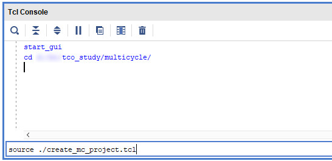

# tco_study
Case study of synchronous FPGA signaling by adjusting the output timing

This is a case-study of synchronous FPGA signaling adjust the t_co (clock-to-output) timing. This
study uses Xilinx's Ultrascale architecture (more precisely the xcku040-ffva1156-2-i device),
however the metodology is general and can be aplied to any FPGA family.

# The problem
Todays protocol are mostly *self synchronous*, which don't need global synchronous behaviour.
However, in some cases we cannot avoid global synchronity. This study shows how can it be achived using
FPGAs even in hard timing cases.

Let's assume that we want to build a [DAQ][1] (Data-acquisition) unit, which requires precision
trigger-timing. All modules need the trigger signal at the same time. (We need to assume that
all modules use the same clock with a given uncereanity.)

# This repository
This repository contains two Vivado projects. (More precisely project creator tcl files.) The first
project is located in the [singlecycle](singlecycle) directory. This project demonstrates three
simple experiments to meet the timing, but the requirements are too challenging to fulfill, so all
output timings fail.

The second project is located in the [multicycle](multicycle) directory. This project demonstrates
how to meet the timing using a *multicycle path* constraint for the output ports. These are successful
ideas, the design fits with the timing analizer requirements.

## Build

To build the projects, just open a Vivado (which supports Kintex Ultrascale devices), enter the
[singlecycle](singlecycle) or [multicycle](multicycle) directory. Then *source* the project creator
file: `source create_mc_project.tcl`



Then just generate the bitstream.


To see timing details click *Open Implemented Desing*.


# Details
Following sections will walk you through from the very basic (but failing) implementations to three
successful solutions.

## Timing requirements

This section is optional. You can skip to the next section, you only need to accept the minimum
`odelay_m = 3.0` and the maximum `odelay_M = 8.0` output delays.

Altera has a quite good [cookbook][2] about timing issues. Or the Xilinx's [Ultrafast design
methodology][3] can help to calculate timing. The following picture is from that book. Chip-to-Chip
Design with Virtual Clocks as Input/Output Ports:


This study only deals with the *B* side, where the FPGA is the signal driver.

Here are the output timing constraints with random values for the delays.
(The `*_m` denotes the minimum, the `*_M` denotes the maximum values)

```tcl
# create a 100MHz clock
create_clock -period 10.000 [get_ports i_clk_p]

#create the associated virtual input clock
create_clock -name clkB_virt -period 10

#create the input delay referencing the virtual clock
#specify the maximum external clock delay from the global oscillator towards the FPGA
set CLK_fpga_m 3.5
set CLK_fpga_M 4
#specify the maximum external clock delay from the global oscillator towards the DAQ module
set CLK_daq_m 5
set CLK_daq_M 6.5
#specify the maximum setup and minimum hold time of the DAQ module
set tSUb 2
set tHb 0.5
#Board delay from FPGA to DAQ module (on trigger)
set BD_trigger_m 6.5
set BD_trigger_M 7.0

# odelay_M = 8.0
# odelay_m = 3.0
set odelay_M [expr $CLK_fpga_M + $tSUb + $BD_trigger_M - $CLK_daq_m]
set odelay_m [expr $CLK_fpga_m - $tHb  + $BD_trigger_m - $CLK_daq_M]

#create the output maximum delay for the data output from the
#FPGA that accounts for all delays specified (odelay_M = 8.0)
set_output_delay -clock clkB_virt -max [expr $odelay_M] [get_ports {<out_ports>}]
#create the output minimum delay for the data output from the
#FPGA that accounts for all delays specified (odelay_m = 3.0)
set_output_delay -clock clkB_virt -min [expr $odelay_m] [get_ports {<out_ports>}]
```

So the final numbers for this study are `odelay_M = 8.0` and `odelay_m = 3.0`.

---

## Single-cycle failings

First, let's show some simple approaches, which don't need deep FPGA knowledge. Altough, we will see
that these implementations cannot fulfill these challenging timing requirements. And finally we will use
a multicycle constraint in the next chapter.

In this chapter all outputs have the following output delay constraints: (See previous chapter for details)

```tcl
#create the output maximum delay for the data output from the
#FPGA that accounts for all delays specified (odelay_M = 8.0)
set_output_delay -clock clkB_virt -max [expr $odelay_M] [get_ports {<out_ports>}]
#create the output minimum delay for the data output from the
#FPGA that accounts for all delays specified (odelay_m = 3.0)
set_output_delay -clock clkB_virt -min [expr $odelay_m] [get_ports {<out_ports>}]
```

### First (native) implementation

The [singlecycle](singlecycle) desing `o_native_p` (/n) ports demonstrate the simplest version.
Simple means a native, fabric flip-flop output connected to the output buffer.

```vhdl
-- Native
inst_native_obufds : OBUFDS
generic map(
  IOSTANDARD => "LVDS"
)
port map(
  O  => o_native_p,
  OB => o_native_n,
  I  => q_native_d2
);
```

This implementation will fail the timings. The timing analizer will report negative-slack in the
setup time of the virtual `clkB_virt` clock:

| Port name   | setup slack | hold slack |
|-------------|-------------|------------|
| o_native_p  | -4.421      | 5.777      |

The negative setup-slack means our signal is too slow. Let's try to make it faster!

### Place into IOB

All FPGAs has a dedicated, fast output flip-flop, which is placed next to the output buffer. The
[singlecycle](singlecycle) project `o_iob_p` (/n) ports demonstrate this solution.

Using Xilinx FPGAs the IOB property says the compiler to place the given flip-flop in the dedicated,
fast output register. This property can be set as the following:
`set_property IOB TRUE [get_cells <register_name>]`

Altough, this results a bit closer slack it still fails the timing.

| Port name | setup slack | hold slack |
|-----------|-------------|------------|
| o_iob_p   | -3.821      | 5.586      |


### Dedicated DDR flip-flop

Another dedicated flip-flop is located in the IO in modern FPGAs. This is the DDR flip-flop. This
approach is implemented by the `o_ddr_p` (/n) output porst. An `ODDRE1` device primitive needs to be
placed in order to drive DDR data:

```vhdl
ODDRE1_inst : ODDRE1
generic map (
  IS_C_INVERTED => '0',  -- Optional inversion for C
  SRVAL => '0'           -- Initializes the ODDRE1 Flip-Flops to the specified value ('0', '1')
)
port map (
  Q => w_ddr,   -- 1-bit output: Data output to IOB
  C => w_clk,   -- 1-bit input: High-speed clock input
  D1 => q_ddr_d2, -- 1-bit input: Parallel data input 1
  D2 => q_ddr_d2, -- 1-bit input: Parallel data input 2
  SR => '0'     -- 1-bit input: Active High Async Reset
); 
```

Note, that to reach the same timing behaviour we need to modify the output delay constraint. The
maximum delay should be reduced by the half period of the system clock (ie. 5ns)

```tcl
set_output_delay -clock clkB_virt -max [expr $odelay_M -5] [get_ports {o_ddr*}]
```

In spite of the efforts the timing fails, what's more this method has the worst results:

| Port name | setup slack | hold slack |
|-----------|-------------|------------|
| o_iob_p   | -4.616      | 5.907      |

### Sum of single-cycle

This FPGA is not fast enough to fulfill these timing requirements. The following tables show all
the setup/hold timings:

The setup slacks:


The hold slacks:


---

## Multicycle solutions

To understand the root cause of the failed timings we should look under hood, and need to understand
the timing details. The timing analizer expects all data at the next clock edge from the launch
clock by default (single-cycle). The following waveform shows the *required data valid window*
on the FPGA pad. The data must be valid throughout this window. (It is permitted for the signal to
be valid earlier or keep data even after this window, but during this slack of time the data *must* be valid.)


(The destination clock uncerteanity and any other delays must be added/substracted to/from odelay_M/m
to get the accurate valid window, but now these are negligible.)

Let's see one particular case. (There is no essential difference between the previously demostrated
failing implementation, so let's choose the *iob* type implementation.)


This default (single-cycle) mode requires faster behaviour, which cannot be fulfilled by this FPGA.
However, the *required valid window* is shorter that the guaranteed, real valid data window.

The length of the *required valid window* is `req_len = odelay_M - odelay_m = 8 - 3 = 5`

The length of the real valid data window is  `req_len + setup_slack + hold_slack = 5 - 3.8 + 5.6 = 6.8`

So if theese windows can be shifted, the timing could be closed.

In most system-synchronous cases additional fix, and known delays are acceptable. Let's shift the
*required data valid window* with a whole clock cycle. This one (or more) clock cycle delay called *multicycle path*.


In this case the FPGA doesn't need to be as fast as in the single-cycle mode, but now it should be
relatively more accurate to hit the whole *required valid window*. What's more, the harder thing is not
to violate the hold time requirements, in other words, to hold data till the end of the *required data
valid window*. So we can say that the FPGA has to be "as slow as possible".

To set the multicycle path only the following constraint is needed:

```tcl
# Set multicycle path for all outputs
set_multicycle_path -to [get_ports o_*] 2
```

The following chapters will show different implementations, which can solve this issue. To see more
details open project from the [multicycle](multicycle) directory.


### Native multicycle implementation

We have seen that the compiler cannot route as fast as required, but maybe it can solve this
multicycle path problem. So let's just implement a simple register, and connect to output port with
the multicycle constraint. This idea is implemented by the `o_native_mc_p` (/n) ports.

After a longer compiling the timing fails in this case too.

| Port name | setup slack | hold slack |
|-----------|-------------|------------|
| o_iob_p   | -3.555      | 0.579      |

What happened? The compiler tried to use general routing resources to add delay to match the
required data valid window. A huge routing time can be seen in the FPGA device view. Turn on the
*Routing resources* option.  and see the
routing snake:

 


The detailed timing report of this failing path is also strange. Here is the setup report, with a more
than 9ns routing time!


But the same routing time in the hold report (which uses the fast model of the FPGA) is less than 5ns:


So the problem is that the FPGA's routing resources has greater uncerteanity than what the constraints
require. Note, that in simpler timing requirements you can stop here, because the router will add a
proper delay. But now we have to investigate more. Let's try to use dedicated delay elements, which
called ODELAY.


### Using ODELAY

Let's try to replace the routing delays with dedicated output delays. This approach is implemented
by the `o_odelay_p` (/n) ports of the [multicycle](multicycle) project. We need to replace the
routing delay of the previous (failed) solution. This was 9.4ns, with -2.4 setup slack. So we need
to delay ~7ns.

Ultrascale's `ODELAYE3` primitive can delays upto 1.25ns in fixed mode. So a cascaded delay
structure is needed to delay ~7ns. But also note that using cascade, additional route delays added,
so lets try with three cascaded `ODELAYE3` primitive. The cascade instantiation is described in the
[UltraScale's SelectIO][4] user guide. 

Wow! This is a working solution. The timing meets the requirements:

| Port name | setup slack | hold slack |
|-----------|-------------|------------|
| o_odelay_p| 0.064       | 0.173      |

However, both setup and hold slacks are tiny. What happened with our great valid window? Let's
see again the detailed timing reports (the datapath delays only). 

Slow model (for setup calculations):


Fast model (for hold calculations):


The same effect can be read from these numbers, as from the first multicycle implementation. The
FPGA's uncerteanity tighten the real valid window. There is big difference between the slow (11.9)
and fast (7.198) models data delay. Now this unwanted effect isn't strong enough, so the timing
could be closed, unlike the native implementation.

The next two chapters will show a more sophisticated solution.


### Using phase shifted clock

`o_iob_shifted_clk_p` (/n) ports of the [multicycle](multicycle) project meet the timing by
adjusting the clock of the last flip-flop. 


This technique quasi adds extra delay to the clock path towards the FPGA (the `CLK_fpga_m` (/M) in
the constraint file). If the value of the `clock_shift` above equals the previously approximated
~7ns, the value of the `tco` will be a simple output delay. The ~7ns of the `clock_shift` has to be
converted to phase for [Xilinx's clock wizzard][5]. `7ns/10ns*360deg = 252deg` The
[multicycle](multicycle) project uses `240deg (6.6ns)` as phase which gives better results.


The timing constraints are met again, with better results than the odelay one:

| Port name            | setup slack | hold slack |
|----------------------|-------------|------------|
| o_iob_shifted_clk_p  | 0.662       | 0.928      |

What great slacks! Both of setup and hold are above half a nanosec.

Two notes for this technique:

 - The data have to be transferred from the `system_clk`
to this new `shifted_clock`, which requires one (or more to help internal timing) flip-flop. The timing
requirements of this internal path (from `system_clk` to `shifted_clock`) is auto generated, cause a
clock generator is used.
 - Maybe a couple of recompilations are needed with adjusted phase values, to get the better output
timings. First, we can think if the setup slack is greater than the hold slack, more phase shift is
needed, and vice versa. But it is misleading, because router can add extra internal delay, (as in
native implementation) which can lead us the wrong way.


### Using inverted clock with ODELAY

The last presented method uses a mixed technology of the previous two. For implementation see
`o_odelay_nclk_p` (/n) ports. A special phase shift is used: the output flip-flop driven by the
inverted system clock. The clock inversion means 50% phase shift, which is 5ns in our case. added a 

| Port name            | setup slack | hold slack |
|----------------------|-------------|------------|
| o_iob_shifted_clk_p  | 0.662       | 0.928      |

### Sum of multicycle solutions:


[1]: https://en.wikipedia.org/wiki/Data_acquisition
[2]: https://www.intel.com/content/dam/www/programmable/us/en/pdfs/literature/manual/mnl_timequest_cookbook.pdf
[3]: https://www.xilinx.com/support/documentation/sw_manuals/xilinx2019_1/ug949-vivado-design-methodology.pdf
[4]: https://www.xilinx.com/support/documentation/user_guides/ug571-ultrascale-selectio.pdf
[5]: https://www.xilinx.com/support/documentation/ip_documentation/clk_wiz/v6_0/pg065-clk-wiz.pdf